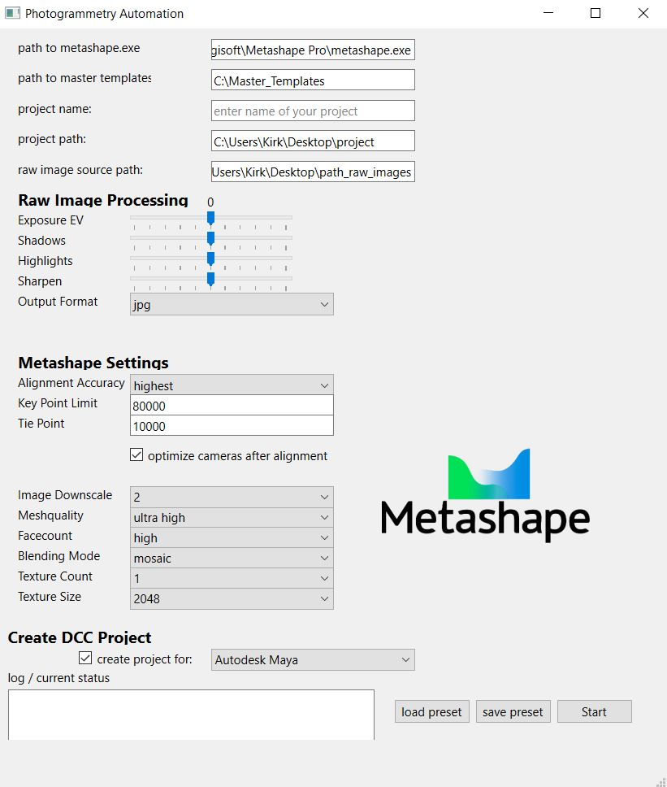

# Photogrammetry-Processing-Automation-Tool
This Python script provides automation for various tasks related to photogrammetry. The script utilizes Pyside and Qt Designer for the graphical user interface. The GUI enables basic image processing for photogrammetry and exposes some of Metashapes most commonly used parameters for scan processing. 

## Demo Video

[](https://www.youtube.com/watch?v=Jf9rVldZUv0)


      ### Python Code Example
      
      ```python
      class MyMainWindow(QMainWindow, Ui_MainWindow):
          def __init__(self):
              super(MyMainWindow, self).__init__()
              self.setupUi(self)
              self.setWindowTitle("Photogrammetry Automation")
              sys.stdout = self
              # Connect signals and slots...

This code snippet defines a custom class MyMainWindow inheriting from QMainWindow and Ui_MainWindow to set up the main window of a photogrammetry automation application using PySide6. The use of classes, inheritance, and method overrides demonstrates proficiency in Python and object-oriented programming principles.



**Graphical User Interface Designed Using Qt Framework**

The graphical user interface (GUI) displayed above is a testament to my extensive experience with the Qt framework, showcasing my ability to design and develop application interfaces efficiently. This project was created using Qt Designer and PySide 6, demonstrating my proficiency in quickly prototyping and iterating GUI designs. In addition to my expertise in Qt for application interface development, this project highlights my proven ability to create mockups and rapid prototypes for automation solutions.


      ### Python Code Example
            
            ```python
          class MyMainWindow(QMainWindow, Ui_MainWindow):
    def __init__(self):
        super(MyMainWindow, self).__init__()
        self.setupUi(self)
        self.setWindowTitle("Photogrammetry Automation")
        sys.stdout = self

        # Connect signals and slots
        self.pushButton_3.clicked.connect(self.load_button_clicked)
        self.pushButton_2.clicked.connect(self.save_button_clicked)
        self.pushButton.clicked.connect(self.start_button_clicked)

        self.log_status = self.textEdit_log_status

    def load_button_clicked(self):
        # Display message in GUI log status
        self.log_status.insertPlainText("Load button pressed\n")
        self.scroll_to_bottom()

        # Open file dialog to select JSON preset
        file_dialog = QFileDialog()
        file_dialog.setNameFilter("JSON Files (*.json)")
        file_dialog.setDefaultSuffix("json")
        file_path, _ = file_dialog.getOpenFileName(self, "Open JSON Preset", "", "JSON Files (*.json)")

        # Check if a file was selected
        if file_path:
            print(f"Loading JSON preset from: {file_path}")

            # Read the data from the specified JSON file
            with open(file_path, 'r') as file:
                data_to_load = json.load(file)

            # Set the GUI variables based on the loaded data
            self.set_gui_from_json_data(data_to_load)

    def set_gui_from_json_data(self, data_to_load):
        # Set GUI elements based on loaded JSON data
        self.horizontalSlider_ev.setSliderPosition(data_to_load.get("Exposure_ev", 0))
        self.horizontalSlider_shadows.setSliderPosition(data_to_load.get("Shadows", 0))
        self.horizontalSlider_highlights.setSliderPosition(data_to_load.get("Highlights", 0))
        self.horizontalSlider_sharpen.setSliderPosition(data_to_load.get("Sharpen", 0))
        self.comboBox_output_format.setCurrentText(data_to_load.get("Output Format", "jpg"))
        # Additional settings...

    def save_button_clicked(self):
        print("Save preset button clicked")
        self.log_status.insertPlainText("Save button clicked\n")
        self.scroll_to_bottom()

        # Get current GUI settings
        exposure_ev = int(self.horizontalSlider_ev.sliderPosition())
        shadows = int(self.horizontalSlider_shadows.sliderPosition())
        highlights = int(self.horizontalSlider_highlights.sliderPosition())
        sharpen = int(self.horizontalSlider_sharpen.sliderPosition())
        output_format = self.comboBox_output_format.currentText()

        # Construct data to save
        data_to_save = {
            "Exposure_ev": exposure_ev,
            "Shadows": shadows,
            "Highlights": highlights,
            "Sharpen": sharpen,
            "Output Format": output_format,
            # Additional settings...
        }

        # Save data to JSON file
        self.save_data_to_json(data_to_save)

    def save_data_to_json(self, data_to_save):
        # Save data to JSON file
        file_dialog = QFileDialog()
        file_dialog.setNameFilter("JSON Files (*.json)")
        file_dialog.setDefaultSuffix("json")
        file_path, _ = file_dialog.getSaveFileName(self, "Save JSON Preset", "", "JSON Files (*.json)")

        if file_path:
            print(f"Saving JSON preset to: {file_path}")
            with open(file_path, 'w') as file:
                json.dump(data_to_save, file, indent=4)

    def start_button_clicked(self):
        print("Start button clicked!")
        # Additional methods...
  

The provided code snippet exemplifies my commitment to writing clean, readable, and maintainable code. Each method is logically structured with descriptive variable names and concise comments, ensuring clarity and ease of maintenance. This approach reflects my dedication to producing high-quality software solutions.


## Features

- **Load and Save Presets**: Allows users to load and save settings presets in JSON format.
- **Raw Image Processing**: Converts RAW image files (NEF format) to JPEG format with specified adjustments (exposure, shadows, highlights, sharpening).
- **Metashape Integration**: Automates the setup and execution of Metashape workflows based on user-defined parameters.
- **Project Folder Creation**: Generates project folder structures and copies necessary template files.


## Directory Structure

project/

│

├── main.py           # Main script file

├── metashape.py      # Main script file

├── ui_mainwindow.ui  # Generated UI file (from Qt Designer)

├── ui_mainwindow.py  # UI design file 

├── resources.py      # resources for UI 

├── README.md         # Project documentation

├── LICENSE           # License file (if applicable)

├── requirements.txt  # Python dependencies

├── .gitignore        # Git ignore file

└─── other files and folders


## Dependencies

- Python 3.x
- `rawpy` library for RAW image processing, needed for Nikon .NEF processing
- `PIL` (Pillow) library for image processing
- `PySide6` library for Qt-based GUI
- `json` for JSON file handling

## Usage

1. **Installation**: Ensure Python 3.x is installed on your system.
2. **Install Dependencies**: Install required Python libraries using `pip`:
   ```bash
   pip install rawpy Pillow PySide6
   ```
3. **Run the Script**:
   - Execute the `main.py` script using Python:
     ```bash
     python main.py
     ```
4. **GUI Usage**:
   - Use the GUI to interact with different functionalities:
     - Click "Load" to load settings from a JSON preset file.
     - Adjust parameters using sliders and dropdowns.
     - Click "Save" to save current settings to a JSON preset file.
     - Click "Start" to initiate the automation process.
